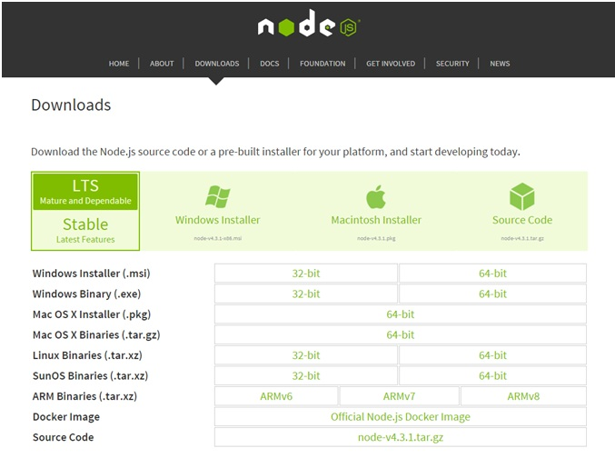
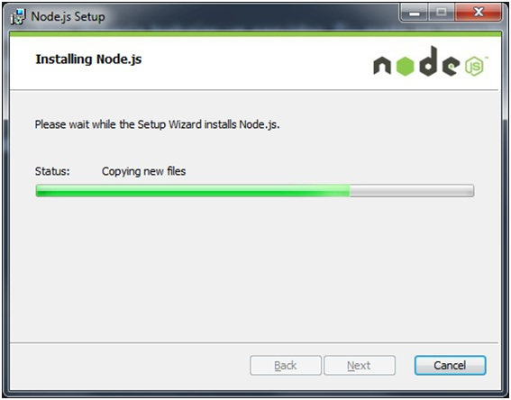
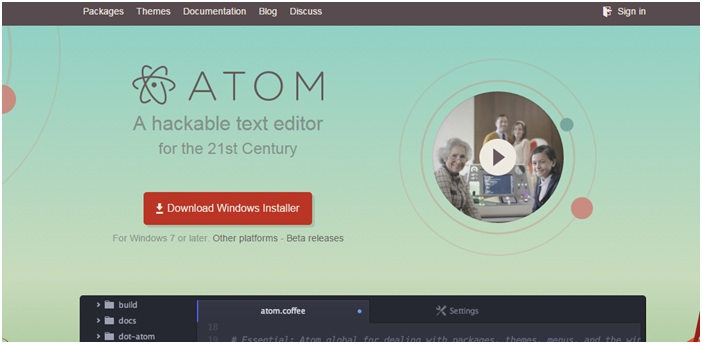
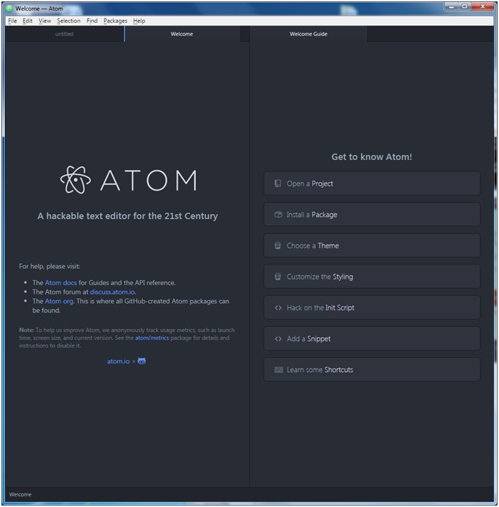
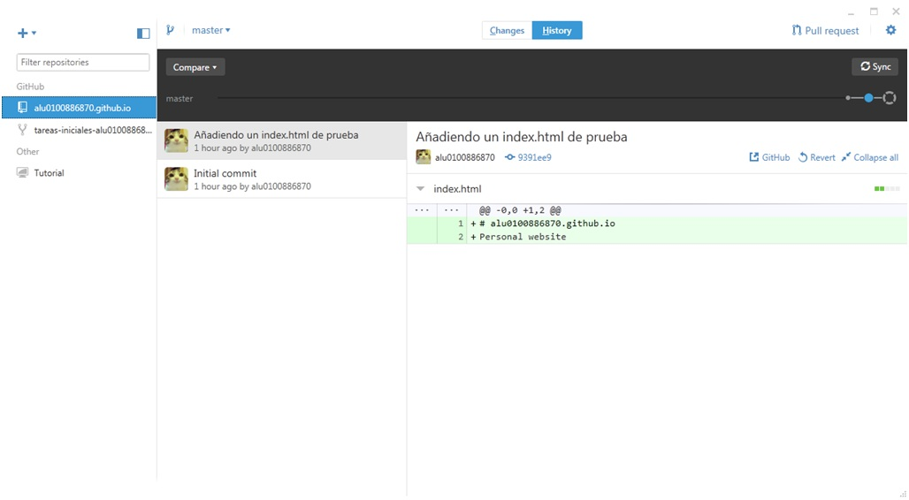
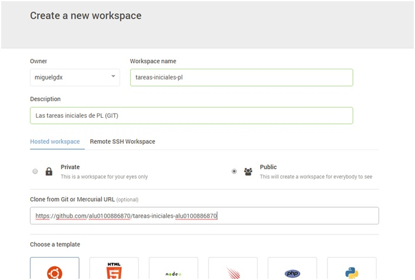
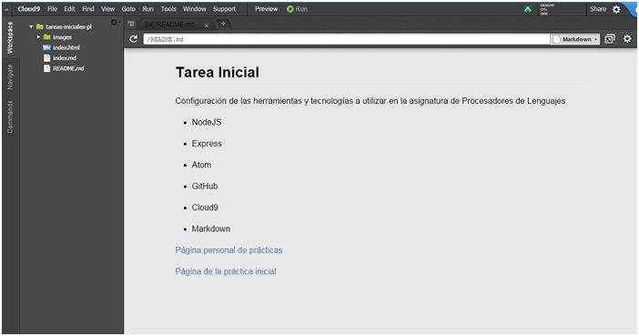

Tutorial NodeJS, Express, Atom, GitHub, Cloud9 y Markdown.
======================================================
# Hecho por alu0100886870 (Miguel Castro)

## Instalación de NodeJS en Windows

Para instalar NodeJS en Windows, simplemente bastará con acceder a la web oficial y descargar el paquete correspondiente a nuestro SO (en mi caso, Windows Installer 64-bit)



Apenas se necesitan un par de clicks para instalarlo (Siguiente, siguiente, etc).



Abrimos CMD e instalamos el framework **Express** con el siguiente comando:

**Comando**

> `npm install express --save`


## Instalación del editor de texto Atom

Para instalar **Atom** hacemos con el paso anterior, ir a su web, descargar el instalador, y seguir todo el proceso de instalación.



Una vez instalado, se abre una ventana como la siguiente:




## Instalación de GitHub Desktop

Igual que antes, lo descargamos, instalamos, iniciamos sesión, y veremos nuestros repositorios.



## Cloud 9

Iniciamos sesión en C9.io, no requiere ninguna descarga.

Creamos un nuevo espacio de trabajo y le indicamos en donde esta nuestro repositorio.



Una vez hecho esto, veremos los archivos correspondientes, a la vez que se nos ofrece un "preview" de los archivos



## Markdown

Markdown es un lenguaje de marcado ligero, lo vamos a utilizar en el editor de texto Atom ya que incorpora por defecto este formato y podremos obtener un live preview mientras vamos desarrollando además de poder exportarlo a HTML sin la necesidad de usar un conversor adicional.

Sintaxis:


Encabezados
```
# Encabezado H1
## Encabezado H2
### Encabezado H3
```
Tipografía
```
**Negrita**
*Cursiva*
> Citas
Parrafo separar por lineas en blanco
`Codigo`
```
Recursos
```

* [Links](https://example.com)
```
Listas
```
1. Lista 1
2. Lista 2

* Lista 1
* Lista 2
```

**Recursos:**

* [NodeJS](https://nodejs.org)
* [Express](http://expressjs.com)
* [Atom IDE](https://atom.io)
* [GitHub Desktop](https://desktop.github.com)
* [GitHub Pages](https://pages.github.com/)
* [Cloud 9 IDE](https://c9.io)
* [Markdown](http://daringfireball.net/projects/markdown/)
* [Resultado del Markdown HTML](http://alu0100886870.github.io/Tutorial-STW/)
